# 🎓 AI Tutor - Smart Document Assistant

A powerful AI-powered document learning assistant that helps you understand and interact with your documents through intelligent Q&A, similar to [YouLearn.ai](https://app.youlearn.ai/).

## ✨ Key Features

### 📋 Two-Screen Workflow
1. **Upload Screen**: Clean, focused document upload interface
2. **Chat Screen**: Document library + AI chat interface (similar to YouLearn.ai)

### 🎯 Core Capabilities
- **Multi-format Support**: PDF, DOCX, and TXT files
- **Intelligent Chunking**: Smart text splitting with configurable chunk size and overlap
- **Vector Storage**: Powered by Qdrant vector database
- **RAG (Retrieval-Augmented Generation)**: AI responses grounded in your documents
- **Source Citations**: See exactly which documents informed each answer
- **Document Management**: Organize documents by User ID
- **Document Switching**: Chat with specific documents or all documents

## 🚀 Quick Start

### 1. Environment Setup

Create a `.env` file in the AI_Tutor directory:

```bash
# Required
QDRANT_URL=your_qdrant_url
QDRANT_API_KEY=your_qdrant_api_key
GEMINI_API_KEY=your_gemini_api_key

# Optional
OPENAI_API_KEY=your_openai_api_key  # For better embeddings (falls back to local)
COLLECTION_NAME=Tutor_Documents     # Defaults to "Tutor_Documents"
```

### 2. Install Dependencies

```bash
pip install -r requirements.txt
```

### 3. Run the Application

**Option A: All-in-one runner (Recommended)**
```bash
python run_app.py
```

**Option B: Manual startup**
```bash
# Terminal 1: Start FastAPI backend
python -m uvicorn api:app --host 0.0.0.0 --port 8000 --reload

# Terminal 2: Start Gradio frontend  
python gradio_app.py
```

### 4. Access the Application

- **Gradio Interface**: http://localhost:7860
- **FastAPI Backend**: http://localhost:8000
- **API Documentation**: http://localhost:8000/docs

## 📱 How to Use

### Step 1: Upload Documents
1. Open the application at `http://localhost:7860`
2. You'll see the **Upload Screen** with:
   - File selector (PDF, DOCX, TXT)
   - User ID input (required for organization)
   - Chunk size and overlap settings (advanced options)
   - Backend status indicator
3. Select your document and enter a User ID
4. Click "🚀 Upload & Process Document"
5. Wait for the success message
6. Click "📖 Go to Document Chat Interface"

### Step 2: Chat with Your Documents
After successful upload, you'll see the **Chat Screen** with two panels:

#### Left Panel - Document Library
- **Current User**: Shows your User ID
- **Document List**: All your uploaded documents with metadata
- **Document Selector**: Switch between specific documents
- **Upload New Document**: Return to upload screen

#### Right Panel - AI Chat Interface
- **Chat History**: Conversation with the AI tutor
- **Message Input**: Ask questions about your documents
- **Quick Questions**: Pre-built prompts for common tasks
  - 📋 Summarize document
  - 🔍 Key concepts  
  - ❓ Main topics

### Step 3: Intelligent Q&A
- Ask questions in natural language
- Get AI responses with source citations
- Switch between documents to focus on specific content
- Use quick question buttons for common queries

## 🏗️ Architecture

### Components

```
AI_Tutor/
├── api.py              # FastAPI backend with RAG endpoints
├── gradio_app.py       # Two-screen Gradio interface  
├── chatbot_service.py  # Google Gemini RAG integration
├── document_processor.py # Multi-format text extraction
├── embedding_service.py   # OpenAI/Local embeddings
├── run_app.py          # All-in-one application runner
├── requirements.txt    # Python dependencies
└── README.md          # This file
```

### Data Flow

```mermaid
graph TD
    A[Upload Document] --> B[Extract Text]
    B --> C[Chunk Text]
    C --> D[Create Embeddings]
    D --> E[Store in Qdrant]
    E --> F[Success → Chat Screen]
    
    G[User Question] --> H[Create Query Embedding]
    H --> I[Vector Search]
    I --> J[Retrieve Context]
    J --> K[RAG with Gemini]
    K --> L[Response + Citations]
```



### API Endpoints

- `POST /upload-document` - Process and store documents
- `POST /search` - Semantic search through documents
- `POST /chat` - RAG-based chat with document context
- `GET /health` - Health check
- `GET /collections/{name}/info` - Collection information

## 🔧 Configuration

### Environment Variables

| Variable | Required | Description | Default |
|----------|----------|-------------|---------|
| `QDRANT_URL` | ✅ | Qdrant vector database URL | - |
| `QDRANT_API_KEY` | ✅ | Qdrant API key | - |
| `GEMINI_API_KEY` | ✅ | Google Gemini API key for chat | - |
| `OPENAI_API_KEY` | ❌ | OpenAI API key for better embeddings | Local fallback |
| `COLLECTION_NAME` | ❌ | Qdrant collection name | "Tutor_Documents" |

### Document Processing Settings

- **Chunk Size**: 500-2000 characters (default: 1000)
- **Overlap**: 50-500 characters (default: 200)
- **Supported Formats**: PDF, DOCX, TXT
- **User Organization**: Documents grouped by User ID

## 🎨 Interface Features

### Upload Screen
- Clean, focused design for document upload
- Real-time backend status monitoring
- Advanced settings with sensible defaults
- Clear instructions and format support info
- Success confirmation with navigation to chat

### Chat Screen (YouLearn.ai Style)
- **Split Layout**: Document management + Chat interface
- **Document Library**: View and switch between documents
- **Source Citations**: See which documents informed each response
- **Quick Questions**: Common educational prompts
- **Real-time Chat**: Immediate AI responses with context

## 🔍 Troubleshooting

### Common Issues

**Backend Not Running**
- Check that `python run_app.py` started successfully
- Verify environment variables are set
- Check port 8000 is not in use

**Upload Fails**
- Ensure User ID is provided
- Check file format is supported (PDF, DOCX, TXT)
- Verify Qdrant connection

**Chat Not Working**
- Confirm GEMINI_API_KEY is set
- Check documents were uploaded successfully
- Verify backend is running and healthy

**No Search Results**
- Upload documents first
- Use natural language queries
- Check if User ID filter is applied correctly

### Logs and Debugging

- Backend logs: Check terminal running FastAPI
- Frontend logs: Check browser console
- Vector DB: Check Qdrant dashboard/logs

## 🤝 Contributing

1. Fork the repository
2. Create a feature branch
3. Make your changes
4. Test thoroughly
5. Submit a pull request

## 📄 License

This project is open source and available under the MIT License.

## 🔗 References

- Inspired by [YouLearn.ai](https://app.youlearn.ai/)
- Built with [Gradio](https://gradio.app/)
- Powered by [FastAPI](https://fastapi.tiangolo.com/)
- Vector storage: [Qdrant](https://qdrant.tech/)
- AI: [Google Gemini](https://ai.google.dev/)

---

**🎓 Happy Learning with AI Tutor!** 